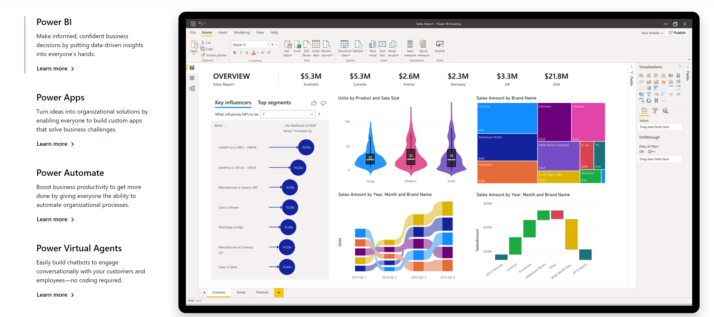
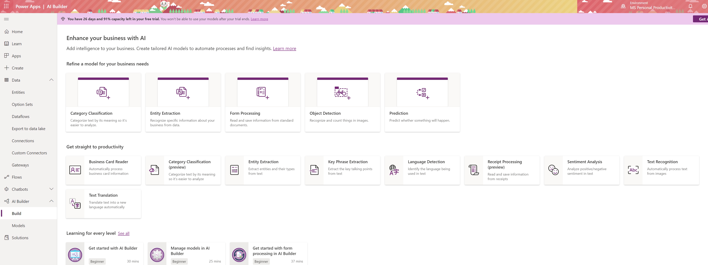
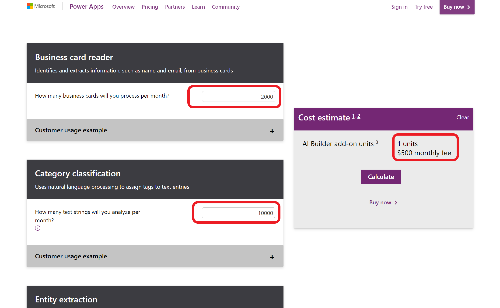
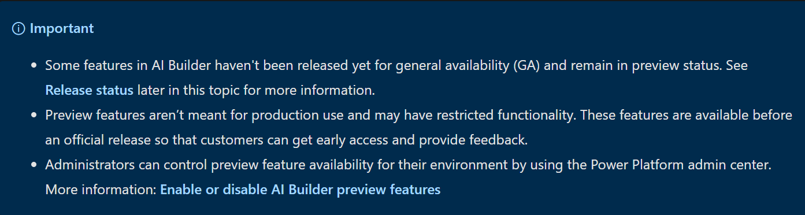

# No Code AI App with Azure Cognitive Services and Power Apps

You might have an idea for an application using AI and not have anyone to build it. You might be a programmer and want to try out your ideas and Azure Custom Vision before you start writing code. No matter what your coding skills are, if you want to prototype an application with AI, Power Platform and it's AI Builder feature is a fast and easy option.

This article explains what the power platform is as well as goes through a step by step process to create an app that detects objects from photos using Power Apps and AI Builder. Check out the video below to see the app we will build to detect different Mixed Reality Headsets such as HoloLens version 1 and 2 Augmented Reality and Virtual Reality headsets and their hand controllers.

  

## What is Power Platform?

Power Platform is a set of **tools,** **API**'s and **SDK**'s that helps you **analyze your data** and build **automations,** **applications** and **virtual agents** with or without having to write any code.

### What are Power Apps?

Power Apps is a set of tools that allows you to create applications with a drag and drop UI and easy integration of your data and 3rd party APIs through connectors.  

A [**connector**](https://docs.microsoft.com/connectors/connectors?WT.mc_id=aiml-8438-ayyonet) is a proxy or a wrapper around an API that allows the underlying service to talk to Microsoft Power Automate, Microsoft Power Apps, and Azure Logic Apps. It provides a way for users to connect their accounts and leverage a set of pre-built **actions** and **triggers** to build their apps and workflows. For example, you can use [Twitter connector](https://docs.microsoft.com/connectors/twitter/?WT.mc_id=aiml-8438-ayyonet) to get tweet data and visualize it in a dashboard or use [Twilio connector](https://docs.microsoft.com/connectors/twilio/?WT.mc_id=aiml-8438-ayyonet) to send your users text messages without having to be an expert in Twitter or Twilio APIs or having to write a line of code. 

Check out the[ list of connectors for Power Apps](https://docs.microsoft.com/en-us/connectors/connector-reference/connector-reference-powerapps-connectors?WT.mc_id=aiml-8438-ayyonet) to see all the APIs that are available. Notice [Power Automate](https://docs.microsoft.com/connectors/connector-reference/connector-reference-powerautomate-connectors?WT.mc_id=aiml-8438-ayyonet) or [Logic App connectors](https://docs.microsoft.com/connectors/connector-reference/connector-reference-logicapps-connectors?WT.mc_id=aiml-8438-ayyonet) might not be the same.

### What is AI Builder?

**AI Builder** is one of the additional features of Power Apps. With AI Builder, you can **add intelligence to your apps** even if you have no coding or data science skills. 

#### What are some of the use cases for AI Builder?

You can use pre-trained models to:

* **Detect** **objects** from images
* **Analyze** your customers **sentiment** from feedback
* Detect **keywords** from text
* **Extract** **specific** **information** about your business from text

#### Is AI Builder the right choice?

Great question! There are so **many tools** out there and **many ways to do the same thing**. How do you know which one is the right solution before investing time and effort?

I have a rule of thumb when I want to build something, use whatever is available and easy to use first. When your needs exceed what the tool you are using covers, look into another solution or building it yourself. 


Use the tool **easiest** to get started when you are building your idea. When your **needs exceed the capabilities** of the tool you are using, find a solution that enables you. Don't invest in building things from scratch before you know it is worth it to do so.


For example, if you have an app idea, it is better to have a prototype running as easily as possible. You can test your ideas before investing your time into building custom designed UI or features. In our specific case, you can first prototype your app with the **drag and drop UI** of **Power Apps** and using **prebuilt AI models**. When your specific needs surface, such as recognizing a particular object or keyword, you can invest your time into creating your custom models to train for the **object** or **keyword detection**.

### Can I use Power Apps and AI Builder for production?

Yes you can. As any tool that does things magically, AI Builder in Power Apps comes with a cost. That does not mean you can't [try your ideas out for free](https://docs.microsoft.com/powerapps/maker/signup-for-powerapps?WT.mc_id=aiml-8438-ayyonet).

#### What will my production app cost?

If you want to go to production with Power Apps, it is a good idea to consider the costs. Thankfully there is an app for that.[ AI Builder Calculator](https://powerapps.microsoft.com/ai-builder-calculator/?WT.mc_id=aiml-8438-ayyonet) let's you input what **AI tools you will need** and **how many users** will be accessing your app's AI features and gives you the price it will cost you. 

#### What are preview features?

AI Builder was released for **public preview** on June 10, 2019 in Europe and the United States. Preview release features are subject to change and may have restricted functionality before the official release for general availability. Preview releases are not meant for production use. You can try them out and influence the final product by giving feedback. 

The **General Availability \(GA**\) release will occur in a phased manner, with some features remaining in **preview status** while others are released for GA. You can check out the release status on the [AI Builder documentation](https://docs.microsoft.com/ai-builder/overview?WT.mc_id=aiml-8438-ayyonet#release-status).

### Can I use Power Apps and AI Builder for production?
#### What will my production app cost?
#### What are the preview features?
## What is Object Detection?
#### How to try out Object Detection capabilities?
#### What can you do with Object Detection?
### How to detect objects from images?
#### How to improve Model performance?
#### What are some best practices for training for object detection?
#### How to share your models?
### How to use your model in a Power App?
## Where to go next?
### Should I keep using my power app or rebuild it?
### How to create a custom feature for Power Apps?
### How to compare costs for Power Apps and Logic Apps?
## AI and Cognitive Services Resources

## Info 

- Title: How to Create a No Code AI App with Azure Cognitive Services and Power Apps
- Publish Urls: 
    - [Microsoft Tech Community](https://techcommunity.microsoft.com/t5/apps-on-azure/how-to-create-a-no-code-ai-app-with-azure-cognitive-services-and/ba-p/1847264)
    - 
- Tags: Power Apps, Cognitive Services, Custom Vision, No Code Apps
- 
