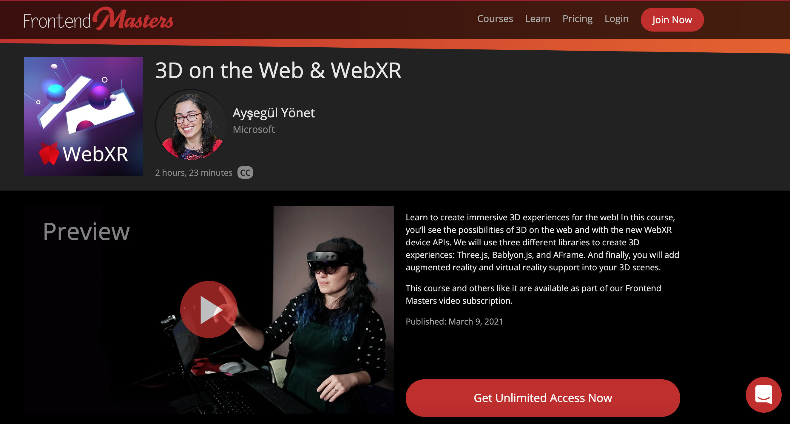

# Talks, Workshops and Videos by Ayşegül Yönet 

## Overview  

This is a list of videos, workshops and conference talks I have given or you can request from me for your events. Detailed descriptions are linked below. I am happy to adjust the level of the talks and workshops for your event. If there is something else you are interested in learning feel free to reach out to me on [twitter@AysSomething](https://twitter.com/AysSomething) or create an issue in this repository. 

You can find more of my tutorials at the [Video and Streaming](#video-and-streaming) links below.

- [Talks And Workshops](#talks-and-workshops)
  - [Video and Streaming](#video-and-streaming)
    - [AI](#ai)
    - [Web](#web)
      - [WebXR](#webxr) 
  - [Talks](#talks)
    - [WebXR](#webxr)
    - [Mixed Reality](#mixed-reality)
    - [AI](#ai-1)
    - [Web](#web-1)
  - [Workshops](#workshops)
    - [WebXR](#webxr-1)
    - [Mixed Reality](#mixed-reality-1)
    - [AI](#ai-2)
    - [Web](#web-2)
  - [Blogs](#blogs)
    - [AI](#ai-3)
    - [Web](#web-3)
  - [Topics](#topics)

## Video and Streaming

- [Twitch@AysSomething](https://www.twitch.tv/ayssomething)
- [YouTube@AysSomething](https://www.youtube.com/channel/UCeo_soIgcgBSd3SVRbs_MPQ)
- [XR Developer YouTube Channel](https://www.youtube.com/channel/UC8ohQvrBXGvEvP_9X98r4bQ)
- [WebXR YouTube Channel](https://www.youtube.com/channel/UCNzjXKJVyqYVyPY8rGKwFtQ)
- [LearnXR Reddit Community](https://www.reddit.com/r/LearnXR/)
- [30 Days of Unreal](https://github.com/Yonet/30DaysOfUnrealEngine/blob/main/README.md)
- [XR Tea Party](https://github.com/Yonet/XRTeaParty)

### AI

- [AI Show Live: aka.ms/AIShowLiveLatest](https://aka.ms/AIShowLiveLatest) every other Friday, 11am-1pm PST, on [bit.ly/LearnTVxr](https://docs.microsoft.com/learn/tv/?WT.mc_id=aiml-8567-ayyonet)
- [AI Show episodes playlist: aka.ms/AIShowLivePlaylist](https://www.youtube.com/playlist?list=PLlrxD0HtieHinivDFATQd5qyjL6ijKHUF)

### Dev

- [How to set up remote development with Github Code Spaces and VS Code](https://youtu.be/ZWJglERhXLw)
- [Introduction to editing Gitbook](https://youtu.be/KL6XhiwrzM0)

### Web

- [Create a Serverless API with VSCode](https://aka.ms/Video/CreateServerlessAPI)

- [Getting started with 3D on the Web: BabylonJS vs ThreeJS code comparison](https://youtu.be/1BbxT9_SFVw)

#### WebXR

### XR 

- [How to Get Started with Mixed Reality Development Using Unity](https://youtu.be/A0FHizvwB44)
- [How to add BingMaps SDK to your project](https://youtu.be/pEdOls9kZGE)

- [BingMaps Part 1 - Import the assets](https://youtu.be/l4qBjz0mu-c)
- [BingMaps - Part 2: Creating the 3D Map](https://youtu.be/PAYMKTKYrnQ)

## Talks

### WebXR

- [Future of WebXR APIs and Data Visualization](./Talks\FutureOfWebXRAPIsAndDataVisualization.md)
- [How to build inclusive web applications using WebXR and AI](./Talks/HowToBuildInclusiveWebApplicationsWebXR&AI.md)
- [Tutorials for Humans](./Talks/TutorialsForHumans.md)
<!-- -  -->

### Mixed Reality

- [Data Driven Mixed Reality Applications](./Talks/DataDrivenMRApplications.md)
- [Future of User Interaction: Mixed Reality, AI and IoT](./Talks/FutureUX.md)
- [How to build inclusive web applications using WebXR and AI](./Talks/HowToBuildInclusiveWebApplicationsWebXR&AI.md)
- [Tutorials for Humans](./Talks/TutorialsForHumans.md)
- [New Possibilities with HoloLens 2](./Talks/NewPossibilitiesWithHoloLens2.md)
- [Immersive IoT Data Visualization](./Talks/ImmersiveIoTDataVisualization)

### AI

- [Smart Apps: How you can incorporate AI into your applications](./Talks/IncorporateAI.md)
- [Azure AI & MR Services](./Talks/AzureAI&MR.md)
- [Building Data Driven Mixed Reality Applications](./Talks/DataDrivenMRApplications.md)
- [Future of User Interaction: Mixed Reality, AI and IoT](./Talks/FutureUX.md)
- [How to build inclusive web applications using WebXR and AI](./Talks/HowToBuildInclusiveWebApplicationsWebXR&AI.md)

## Workshops

### WebXR

- [3D on the Web & WebXR FrontendMasters Course](https://frontendmasters.com/courses/3d-webxr/), [workshop details](./Workshops/3DontheWev&WebXR.md)

- [Getting started with Babylon.js](./Workshops/GettingStartedWithBabylonJS.md)

- [Virtual Reality Development on the Web](http://bit.ly/fem-webvr)
- [Augmented Reality on The Web](https://youtu.be/trQYd-HVoBg)

### Mixed Reality

- [Developing Multi-Platform Spatial Visualizations with Azure Spatial Anchors](Workshops\AzureSpatialAnchors.md)

- [Developing Multi-Platform Mixed Reality Solutions](./Workshops/DevelopingMulti-PlatformMixedRealitySolutions.md)
- [Mixed Reality Development with JavaScript](https://github.com/Yonet/MRDocs)
- [Virtual Reality Development on the Web](http://bit.ly/fem-webvr)

### AI

- [Getting Started with Computer Vision](./Workshops/GettingStartedComputerVision.md) 

### Topics 

Feel free to open an issue or reach out to me on twitter@AysSomething to request a talk about below topics:

* Mixed Reality Development for HoloLens: http://bit.ly/MixedRealityDocs
* Mixed Reality JavaScript Development: https://bit.ly/MixedRealityJavaScript
* Azure Spatial Anchors: http://bit.ly/AzureSpatialAnchors
* Azure AI Services: http://bit.ly/AzureAIServices
* Azure Speech: http://bit.ly/AzureSpeech
* Speech To Text: http://bit.ly/SpeechApi
* Ink Recognizer: http://bit.ly/InkRecognizer
* Form Recognizer: http://bit.ly/FormRecognizer
* Digital Twins: http://bit.ly/AzureDigitalTwins

## Blogs

### AI

- [Accelerating the time to value with Azure Applied AI Services](https://techcommunity.microsoft.com/t5/azure-ai/accelerating-the-time-to-value-with-azure-applied-ai-services/ba-p/2377309?WT.mc_id=aiml-8567-ayyonet)
- [Integrating AI: Prototyping a No-Code solution with Power Apps](https://techcommunity.microsoft.com/t5/azure-ai/integrating-ai-prototyping-a-no-code-solution-with-power-apps/ba-p/2189550?WT.mc_id=aiml-8567-ayyonet)

### Web

- [How to Fix Your Security Vulnerabilities with NPM Overrides](https://medium.com/p/c4b5be0ab4f6)
- [Everything you need to know to deploy an Azure Static Web App](https://dev.to/azure/everything-you-need-to-know-to-deploy-an-azure-static-web-app-fm6)
