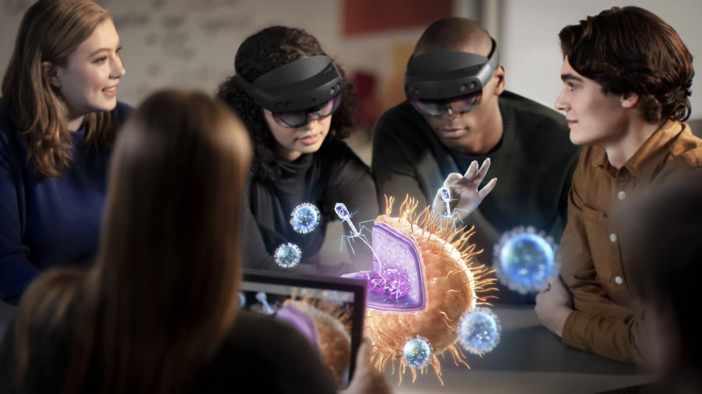

# Developing Multi-Platform Spatial Visualizations with Azure Spatial Anchors

  - [Overview](#overview)
    - [Objective](#objective)
    - [Five Things Audience Members Will Learn](#five-things-audience-members-will-learn)
    - [Target Audience](#target-audience)
    - [Assumed Audience Knowledge](#assumed-audience-knowledge)
    - [Level](#level)
    - [Content tags](#content-tags)
  - [Agenda](#agenda)

## Overview

### What is [Azure Spatial Anchors](https://docs.microsoft.com/windows/mixed-reality/spatial-anchors?WT.mc_id=talksAndWorkshops-github-ayyonet)?

Spatial Anchors allows you to place virtual object in a specific place in your real world. Spatial Anchors are available in iOS, Android and HoloLens headsets.
[Azure Spatial Anchors](https://docs.microsoft.com/azure/spatial-anchors/overview?WT.mc_id=talksAndWorkshops-github-ayyonet) gives you a way to save and share anchor points in space, so that you can share the virtual objects or information between multiple devices and persist them over time.

### Why Use Spatial Anchors?

Using Azure Spatial Anchors allow you to share any information in specific context, time and space. 
Some of the use cases are having user guides of machinery, inventory information, way-finding applications, educational applications, multi-player games. 
Having smartphones and having access to the GPS data changed the apps we build and enabled ride sharing and location based recommendation applications.
Developing with Azure Spatial Anchors will help you deliver contextual data at the right time and place and will open up new possibilities indoors. 

In this workshop, you will learn how to get started with developing a mixed reality applications, using Azure Spatial Anchors for Android, iOS or HoloLens, using. 

### Objective

Getting started with Azure Spatial Anchors and Mixed Reality Application development.

### Five Things Audience Members Will Learn

What are the tools to build multi-platform Mixed Reality experiences?
How to get started with Azure Spatial Anchors SDK?
How to connect your [Spatial Anchors to develop a way-finding experience?](https://docs.microsoft.com/en-us/azure/spatial-anchors/concepts/anchor-relationships-way-finding?WT.mc_id=talksAndWorkshops-github-ayyonet)
What could go wrong?
What are the design considerations that would make your app a better user experience?

### Target Audience

General knowledge of development.

### Assumed Audience Knowledge

- Basic programming concepts as loops, arrays and objects.
- Working with REST APIs.

### Level

Beginner

### Content tags

[MixedReality](https://docs.microsoft.com/windows/mixed-reality/?WT.mc_id=talksAndWorkshops-github-ayyonet), [SpatialAnchors](https://docs.microsoft.com/azure/spatial-anchors/overview?WT.mc_id=talksAndWorkshops-github-ayyonet), [Unity3D](https://docs.microsoft.com/windows/mixed-reality/unity-development-overview?WT.mc_id=talksAndWorkshops-github-ayyonet), [MixedRealityToolKit](https://github.com/Microsoft/MixedRealityToolkit-Unity/releases?WT.mc_id=talksAndWorkshops-github-ayyonet), [HoloLens](https://docs.microsoft.com/azure/spatial-anchors/quickstarts/get-started-unity-hololens?WT.mc_id=talksAndWorkshops-github-ayyonet), Android, IOS, 3D, AR, SpatialAudio, DataViz Design, Mobile, Performance, Wearables

## Agenda

### Location aware Mixed Reality content. How to get started with Azure Spatial Anchors (ASA) Service

- Overview of Spatial Anchors.

- Saving, retrieving and sharing ASA.

- Adding ASA to the application.

- Tips and Tricks.

